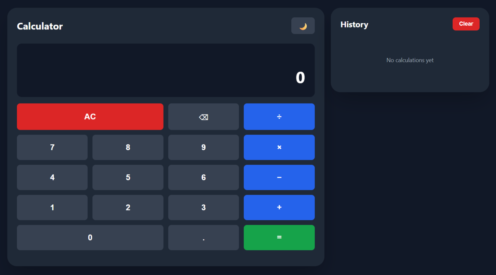
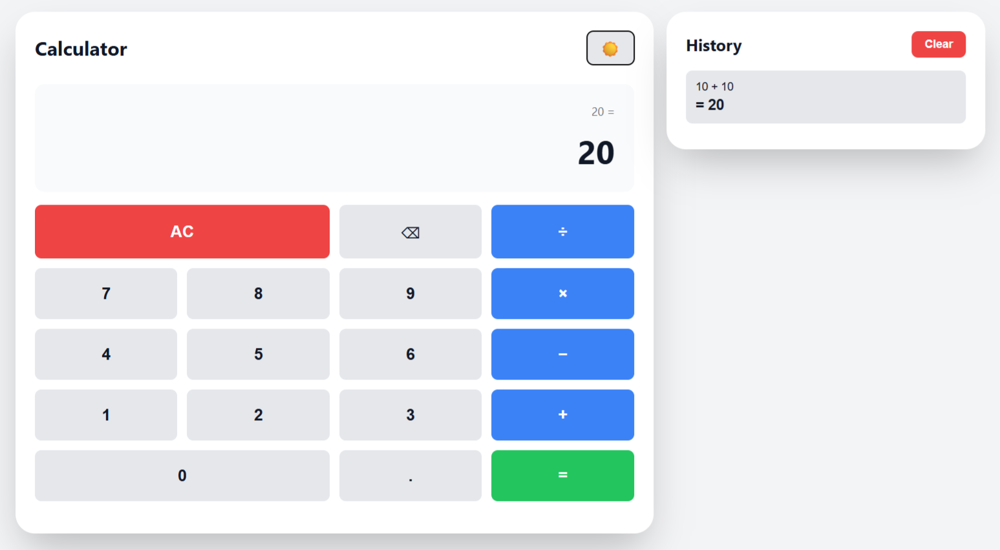

# 🧮 Simple Calculator

A clean, modern calculator web app built with vanilla HTML, CSS, and JavaScript. Features calculation history, theme switching, and full keyboard support.


## ✨ Features

- **Basic Operations** - Addition, subtraction, multiplication, division
- **Calculation History** - Stores your last 10 calculations
- **Theme Switching** - Toggle between dark and light themes
- **Keyboard Support** - Use your keyboard for faster input
- **Responsive Design** - Works on mobile, tablet, and desktop
- **Local Storage** - Remembers your history and theme preference
- **Error Handling** - Displays friendly error messages (e.g., division by zero)

## 🚀 Demo

[Live Demo](https://RohitGarudkar.github.io/calculator) 

## 📸 Screenshots

### Dark Theme


### Light Theme


## 🛠️ Installation & Setup

### Option 1: Clone the Repository

```bash
# Clone the repo
git clone https://github.com/RohitGarudkar/calculator.git

# Navigate to project directory
cd calculator

# Open index.html in your browser
# On Mac
open index.html

# On Windows
start index.html

# On Linux
xdg-open index.html
```

### Option 2: Download ZIP

1. Click the green "Code" button on GitHub
2. Select "Download ZIP"
3. Extract the ZIP file
4. Open `index.html` in your browser

### Option 3: Use Live Server (Recommended for Development)

If you have VS Code installed:

1. Install the "Live Server" extension
2. Right-click on `index.html`
3. Select "Open with Live Server"

## 📁 Project Structure

```
calculator/
│
├── index.html          # Main HTML file
├── style.css           # All styles and themes
├── script.js           # Calculator logic and functionality
├── README.md           # Project documentation
└── screenshots/        # Screenshots for README
    ├── dark-theme.png
    ├── light-theme.png
    └── mobile-view.png

```

## 🎮 How to Use

### Mouse/Touch Input
- Click number buttons (0-9) to input digits
- Click operator buttons (+, −, ×, ÷) to perform operations
- Click "=" to calculate result
- Click "AC" to clear everything
- Click "⌫" to delete last digit
- Click history items to reuse previous results

### Keyboard Input
- **0-9** - Input numbers
- **+ - * /** - Operators
- **Enter or =** - Calculate result
- **Escape** - Clear all
- **Backspace** - Delete last digit
- **.** - Decimal point

### Theme Switching
- Click the 🌙/☀️ button to toggle between dark and light themes
- Your preference is saved automatically

### History
- Last 10 calculations are saved
- Click any history item to use its result in a new calculation
- Click "Clear" button to delete all history
- History persists even after closing the browser

## 🎨 Customization

### Changing Colors

Edit the CSS variables in `style.css`:

```css
:root {
    --bg: #111827;              /* Background color */
    --container-bg: #1f2937;    /* Calculator background */
    --btn-operator: #2563eb;    /* Operator button color */
    /* ... more variables */
}
```

### Adding More Features

The code is organized into clear functions in `script.js`:
- `inputNumber()` - Handles number input
- `calculate()` - Performs calculations
- `addToHistory()` - Manages history
- Add your own functions easily!

## 🧪 Browser Support

- Chrome (recommended)
- Firefox
- Safari
- Edge
- Opera

Works on all modern browsers with ES6 support.

## 📱 Mobile Support

Fully responsive design that works on:
- 📱 Mobile phones
- 📱 Tablets
- 💻 Laptops
- 🖥️ Desktops

## 🐛 Known Issues

None currently! If you find a bug, please [open an issue](https://github.com/RohitGarudkar/calculator/issues).

## 🤝 Contributing

Contributions are welcome! Here's how you can help:

1. Fork the repository
2. Create a new branch (`git checkout -b feature/amazing-feature`)
3. Make your changes
4. Commit your changes (`git commit -m 'Add some amazing feature'`)
5. Push to the branch (`git push origin feature/amazing-feature`)
6. Open a Pull Request

## 👨‍💻 Author

**Your Name**
- GitHub: [@RohitGarudkar](https://github.com/RohitGarudkar)
- LinkedIn: [Rohit Garudkar](https://linkedin.com/in/rohitgarudkar)

## 🙏 Acknowledgments

- Inspired by various calculator designs
- Icons from emoji set
- Built as a learning project

## 📞 Support

If you have any questions or need help, feel free to:
- Open an issue on GitHub
- Contact me via email: your.email@example.com

---

Made with ❤️ by [Rohit Garudkar]#


